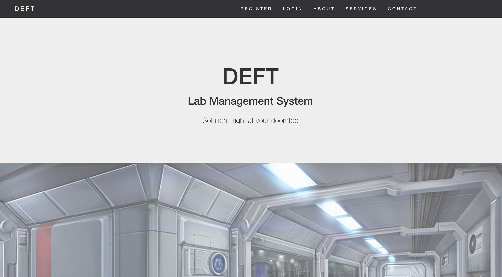
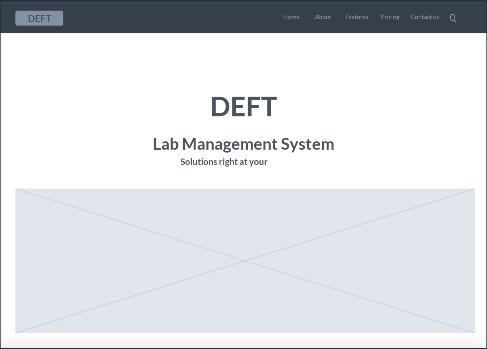
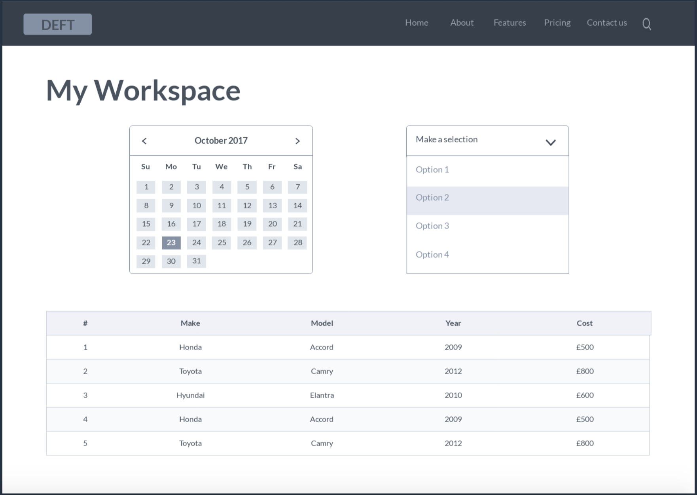
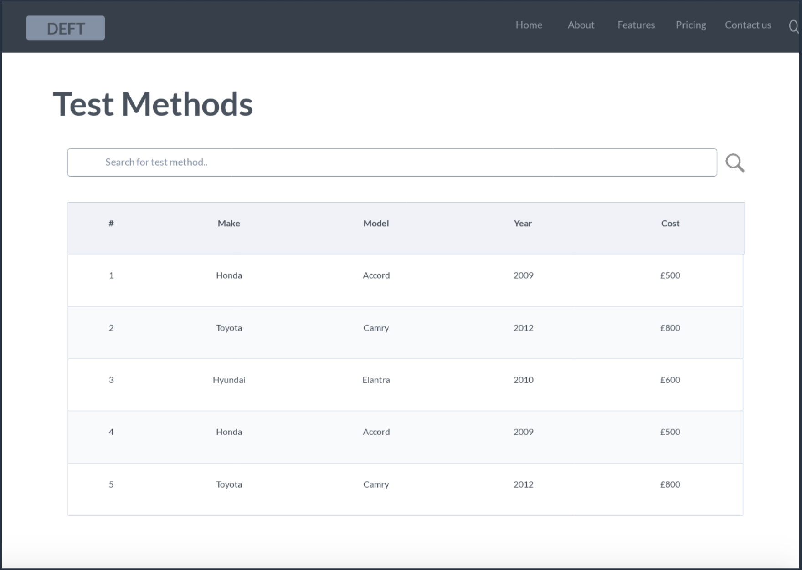

# :clipboard: DEFT: A Lab Management System 
Mission: To create a user-friendly platform for laboratories to manage day-to-day operations. 




## :paperclip: What is DEFT?
DEFT started off as a class project based on <b>React</b>, <b>Express.js</b> and <b>Node.js</b>. It is now an open-source application that facilitates the effective management of samples, equipment and associated data. Using this system will allow automated workflows and reproducibility of analysis results.


## :pencil2: Getting Started
Try it out!
- On me: <a href="https://deft-lms.herokuapp.com/">DEFT@Heroku</a>
- On your own: Go through the simple steps below:
```
git clone https://github.com/audthenerd/deft_lms.git
cd deft_lms
node index.js
```

## :hammer: Build Process
Here is a summary of the stages of building this application:
  ### Step 1: Wireframing
  Drafting of wireframes on <a href="https://marvelapp.com/">Marvel App</a> helped with the visualisation process. <br>
  
  
  
  
  ### Step 2: Choosing the Parameters
  Choosing the key components that are required in a lab management system was crucial to ensure that the application would   be efficient and controlled for traceability. Here is a list of them:<br>
  - <b>Permission Control</b>: Currently has 3 levels (Supervisor/Administrator, Chemist, Technician). Can be altered            according to the lab's hierachy. This controls who is able to access what.<br>
  - <b>Samples</b>: Add new samples, edit existing samples <br>
  - <b>Equipment</b>: Add new equipment, edit existing equipment <br>
  - <b>Test Methods</b>: Add new methods, edit existing methods, search for methods <br>
  - <b>Reports</b>: Generate reports from sample analysis results entered by the lab staff - WIP

## :phone: FAQ & Contact
Have questions?

Contact me at <br>
- :email: aud.kow88@gmail.com
  


